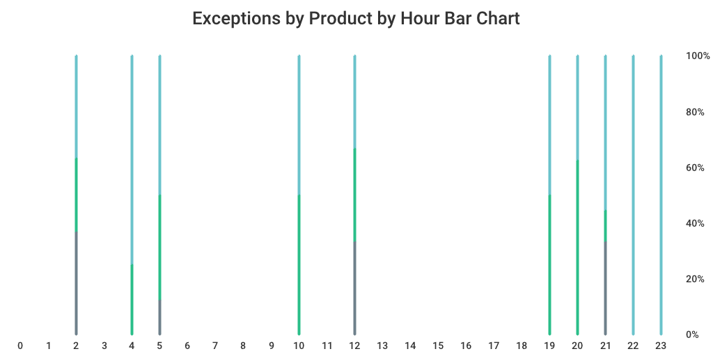

README
------
`alertFrequency` scans de folder passed as an argument and all its sub-folders for *.log files. *.log files are expected to have the following schema:
```
HH:MM:SS Message with spaces SEVERITY PRODUCT APPLICATION
```
All records with severity `EXCEPTION` are counted in and ranked by hour and by product. Results are ultimately served on a local web server at http://localhost:8265/.

Sample logs are provided in the `_logs` folder. The following graphs were generated from them:



